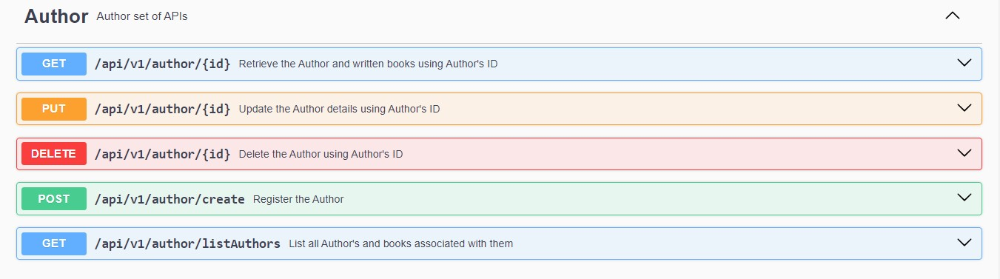

#A BOOKSTORE CRUD APPLICATION --

# **Requirements**

BASICS

- Integrated Development Environment (IDE): IntelliJ IDEA
- Java Development Kit (JDK)
- MySQL 
- Postman

STEPS

- Go to spring initializr (Spring Initializr is a web-based tool provided by the Spring team that allows developers to quickly generate the basic structure and configuration files for a new Spring-based project)
Project: Maven(Maven is a popular build automation and dependency management tool used primarily in Java projects)
- Language: Java(springboot)
- Spring Boot version: 3.3.1
- Packaging: Jar
- Java version: 17

# *  Add some Dependencies: *
- Spring Web: It is a module of the Spring Framework that provides support for building web applications and RESTful APIs.
- Lombok: Java library that helps reduce boilerplate code in Java classes by providing annotations that automatically generate common code, such as getters, setters, constructors, and more.
- Spring Data JPA: It is a part of the Spring Data project that simplifies the development of data access layers in Java applications using the Java Persistence API (JPA).
- MySQL Drive: MySQL Driver, also known as the MySQL Connector/J, is a Java database driver specifically designed to connect Java applications with MySQL databases

#OTHER(not inside the Spring Initializr dependencies)
- ModelMapper: Java library that helps make mapping easy. This helps especially dealing with our dtos
- Openapi - Swagger: This automatically deploy swagger-ui to the spring-boot application. It helps us with our documentation

DEVELOPMENT

- Open the project on your IDE
- Go to application.properties: (It is a configuration file used in Spring Boot applications to specify various properties and settings for the application.) to create the MySQL connection
- Create a database called “bookstore” using MySQL
- Do not forget to add your own username and password
- Add the following configuration to the file
- Run the application and there should not be any problem

TO ACCESS THE DOCUMENTATION:
- Once the application is running
- Run  http://localhost:8080/swagger-ui/index.html#/ then you can easily interact with the API'S

# ** Project Flow 
- The client makes an HTTP request to a specific endpoint of the application, typically initiated through a web browser or API client.
- The request is received by the Controller, which is responsible for handling the request.
- The Controller extracts the necessary data from the request, such as request parameters or the request body.
- The Controller invokes the appropriate method(s) in the Service layer to perform the required business logic and data operations.
- The Service layer interacts with the Repository layer to perform data access and persistence operations, if required.
- The Service layer may also perform additional processing, such as validation, transformation, or aggregation of data.
- The Service layer returns the result of the operation to the Controller.
- The Controller prepares the HTTP response, including the response status, headers, and body.
- The response is sent back to the client, completing the request-response cycle.

# *** ENDPOINTS ** #

